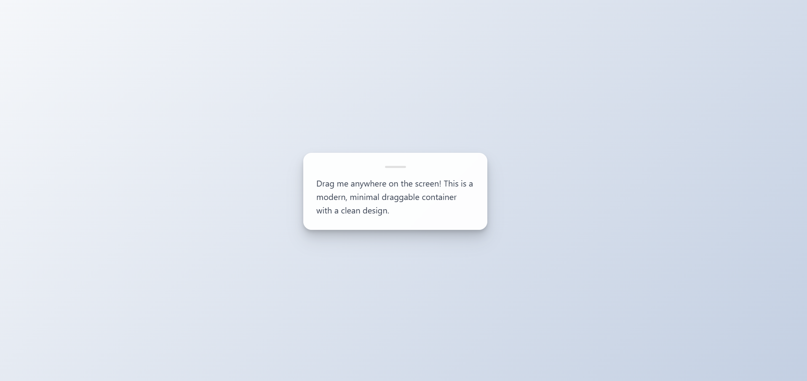

# Draggable Container - JavaScript Implementation Guide

A pure JavaScript implementation that enables smooth dragging of elements across the screen without any external dependencies.



## Core Implementation
This is the foundational code that makes dragging possible - it tracks mouse movements and translates them into element position updates.

```javascript
const draggable = document.querySelector('.draggable');
let offsetX, offsetY;

const dragMouseDown = (e) => {
    e.preventDefault();
    offsetX = e.clientX - draggable.offsetLeft;
    offsetY = e.clientY - draggable.offsetTop;
    document.addEventListener('mousemove', dragMove);
    document.addEventListener('mouseup', dragMouseUp);
};

const dragMove = (e) => {
    e.preventDefault();
    draggable.style.left = (e.clientX - offsetX) + 'px';
    draggable.style.top = (e.clientY - offsetY) + 'px';
};

const dragMouseUp = () => {
    document.removeEventListener('mousemove', dragMove);
    document.removeEventListener('mouseup', dragMouseUp);
};

draggable.addEventListener('mousedown', dragMouseDown);
```

## How It Works - Step by Step

### 1. Initial Setup
The first step is to select our draggable element and create variables to track mouse position relative to the element.

```javascript
const draggable = document.querySelector('.draggable');
let offsetX, offsetY;
```
This code selects our target element and initializes tracking variables that will help maintain smooth dragging.

### 2. Mouse Down Event (dragMouseDown)
When the user clicks on the element, we calculate where exactly they clicked relative to the element's edges.

```javascript
const dragMouseDown = (e) => {
    e.preventDefault();
    offsetX = e.clientX - draggable.offsetLeft;
    offsetY = e.clientY - draggable.offsetTop;
    // ...
};
```
This function captures the initial click position and prevents default browser behaviors that might interfere with dragging.

### 3. Mouse Move Event (dragMove)
As the mouse moves, we continuously update the element's position while maintaining the original click offset.

```javascript
const dragMove = (e) => {
    e.preventDefault();
    draggable.style.left = (e.clientX - offsetX) + 'px';
    draggable.style.top = (e.clientY - offsetY) + 'px';
};
```
This is where the actual dragging happens - the element's position is updated in real-time based on mouse movement.

### 4. Mouse Up Event (dragMouseUp)
When the user releases the mouse, we clean up our event listeners to prevent memory leaks.

```javascript
const dragMouseUp = () => {
    document.removeEventListener('mousemove', dragMove);
    document.removeEventListener('mouseup', dragMouseUp);
};
```
This cleanup is crucial for maintaining performance and preventing unwanted behaviors.

### 5. Event Listener Setup
We attach the initial mouse down listener that starts the whole dragging process.

```javascript
draggable.addEventListener('mousedown', dragMouseDown);
```
This single line initiates our drag functionality by listening for the initial click.

## Key Concepts Explained

### Event Flow
The sequence of events that creates smooth dragging functionality.
1. User clicks element → `mousedown` event fires
2. User moves mouse → `mousemove` events fire repeatedly
3. User releases mouse → `mouseup` event fires

### Position Calculation
Understanding how we calculate positions is crucial for smooth dragging.
- Initial Offset:
  ```javascript
  offsetX = mousePosition - elementCurrentPosition
  ```
  This calculation determines where in the element the user clicked.

- New Position:
  ```javascript
  newPosition = currentMousePosition - initialOffset
  ```
  This maintains the original click point relative to the mouse position.

### Why We Need Offset
Offset calculation is crucial for natural-feeling drag behavior.
```javascript
// Without offset (wrong)
element.style.left = e.clientX + 'px';  // Element jumps to mouse position

// With offset (right)
element.style.left = (e.clientX - offsetX) + 'px';  // Element moves smoothly
```

## Performance Considerations
Proper event handling and cleanup are essential for smooth performance.

1. **Event Delegation**
   ```javascript
   // Events are bound only during drag
   document.addEventListener('mousemove', dragMove);
   document.addEventListener('mouseup', dragMouseUp);
   ```
   This approach minimizes active event listeners.

2. **Cleanup**
   ```javascript
   // Always remove listeners when done
   document.removeEventListener('mousemove', dragMove);
   document.removeEventListener('mouseup', dragMouseUp);
   ```
   Proper cleanup prevents memory leaks and performance degradation.

## Common Issues & Solutions
Understanding common pitfalls helps create more robust drag functionality.

1. **Jumpy Movement Fix**
   ```javascript
   // The offset maintains smooth movement
   element.style.left = (e.clientX - offsetX) + 'px';
   ```
   This solution ensures the element moves smoothly without jumping.

2. **Event Listener Cleanup**
   ```javascript
   function dragEnd() {
       document.removeEventListener('mousemove', dragMove);
       document.removeEventListener('mouseup', dragMouseUp);
   }
   ```
   Always clean up event listeners to prevent memory leaks.

## Debug Tips
These debugging techniques help identify issues in your drag implementation.

1. **Console Logging Positions**
   ```javascript
   const dragMove = (e) => {
       console.log({
           mouseX: e.clientX,
           mouseY: e.clientY,
           offsetX: offsetX,
           offsetY: offsetY
       });
   };
   ```
   This logging helps track position calculations during dragging.

2. **Check Event Firing**
   ```javascript
   const dragMouseDown = (e) => {
       console.log('Mouse down fired at:', e.clientX, e.clientY);
       // ... rest of the code
   };
   ```
   Verify that events are firing as expected during the drag sequence.

## Potential Enhancements
These additions can improve the basic dragging functionality.

1. **Boundary Detection**
   ```javascript
   const dragMove = (e) => {
       const newX = Math.min(Math.max(0, e.clientX - offsetX), 
                            window.innerWidth - element.offsetWidth);
       element.style.left = newX + 'px';
   };
   ```
   This enhancement keeps the element within viewport boundaries.

2. **Touch Support**
   ```javascript
   element.addEventListener('touchstart', (e) => {
       const touch = e.touches[0];
       dragMouseDown(touch);
   });
   ```
   Add touch support for mobile devices with this code.